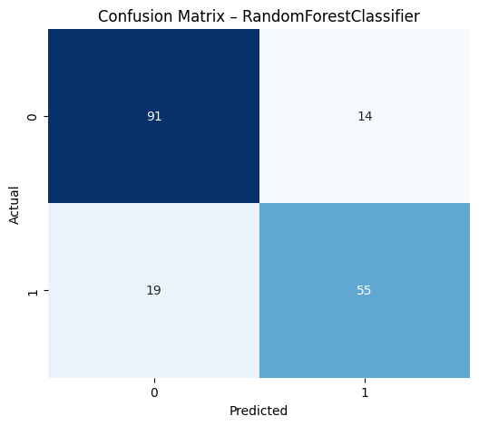

# 🚢 Titanic Survival Prediction

A complete end-to-end machine learning pipeline that benchmarks **six classification algorithms** on the Kaggle Titanic dataset. The project covers feature engineering, preprocessing, hyperparameter tuning with cross-validation, model comparison, and final model selection.

---

## 📂 Dataset

| Property | Value |
|---|---|
| Source | [Kaggle – Titanic: Machine Learning from Disaster](https://www.kaggle.com/c/titanic/data) |
| Training samples | 891 |
| Features | 12 raw (Age, Sex, Pclass, Fare, SibSp, Parch, etc.) |
| Target | `Survived` (0 = No, 1 = Yes) |

> Download `train.csv` from Kaggle and place it in the project root before running the notebook.

---

## ⚙️ Feature Engineering

Two features were engineered that provided the most significant performance gains across all models:

- **`Title`** — extracted from passenger names (Mr, Mrs, Miss, Master, Rare). Captures social class, age group, and marital status implicitly.
- **`FamilySize`** — computed as `SibSp + Parch + 1`. Both very large families and solo travellers showed lower survival rates.

**Columns dropped:** `PassengerId`, `Name`, `Ticket`, `Cabin`, `Embarked`  
(`Embarked` was excluded after showing near-zero feature importance in preliminary analysis.)

---

## 🧹 Preprocessing Pipeline

A unified `sklearn` pipeline was applied consistently across all six models before training:

| Feature Type | Imputation | Scaling / Encoding |
|---|---|---|
| Numeric (`Age`, `Fare`, `SibSp`, `Parch`, `FamilySize`) | Median | StandardScaler (zero mean, unit variance) |
| Categorical (`Sex`, `Title`) | Mode | One-Hot Encoding (drop first to avoid dummy trap) |

Data split: **80% train / 20% test** with stratification on the target variable.

---

## 🤖 Models & Hyperparameter Tuning

Each model was tuned using `GridSearchCV` with **5-fold cross-validation** on the training set.

| Model | Best Hyperparameters |
|---|---|
| Logistic Regression | `C = 10` |
| Random Forest | `n_estimators = 150`, `max_depth = 6`, `min_samples_split = 5` |
| KNN | `n_neighbors = 3` |
| Gradient Boosting | `learning_rate = 0.05`, `max_depth = 5`, `n_estimators = 100` |
| SVM (RBF kernel) | `C = 1`, `gamma = 'scale'` |
| MLP Neural Network | `hidden_layer_sizes = (50,)`, `alpha = 0.0001`, `learning_rate_init = 0.001` |

---

## 📊 Results

Models ranked by test accuracy:

| Model | Test Accuracy | Precision | Recall | F1 Score | CV Accuracy (5-fold) |
|---|---|---|---|---|---|
| Gradient Boosting | **0.821** | 0.800 | 0.757 | 0.778 | 0.830 ± 0.021 |
| Random Forest | 0.816 | 0.797 | 0.743 | 0.769 | **0.834 ± 0.024** |
| Logistic Regression | 0.810 | 0.786 | 0.743 | 0.764 | 0.824 ± 0.015 |
| SVM (RBF) | 0.810 | 0.794 | 0.730 | 0.761 | 0.829 ± 0.014 |
| MLP Neural Network | 0.782 | 0.761 | 0.689 | 0.723 | 0.822 ± 0.025 |
| KNN | 0.732 | 0.691 | 0.635 | 0.662 | 0.806 ± 0.024 |

---

## 🏆 Best Model: Random Forest

**Random Forest** was selected as the final model based on the highest 5-fold CV accuracy (**83.4%**), which is the more reliable indicator of generalisation than a single test-set score. Gradient Boosting edges it out on raw test accuracy (82.1% vs 81.6%), but the difference is within the margin of variance, and Random Forest offers better interpretability via feature importances.

### Confusion Matrix — Random Forest

```
              Predicted: 0    Predicted: 1
Actual: 0         91              14
Actual: 1         19              55
```

- **True Negatives (correctly predicted not survived):** 91  
- **True Positives (correctly predicted survived):** 55  
- **False Positives:** 14  
- **False Negatives:** 19  

### Model Comparison — Test vs CV Accuracy


<!-- TODO: replace image2.png with your exported bar chart (test accuracy vs CV accuracy, best CV model outlined) -->

### Confusion Matrix — Best Model



---

## 🧠 Key Takeaways

1. **[MODEL NAME] is the final choice based on 5-fold CV accuracy ([CV %]%)** — with stratified sampling preserving the true ~38/62 survival split across train and test sets, this is the most reliable generalisation estimate available here.
2. **Feature engineering was the biggest lever** — extracting `Title` alone produced the most consistent accuracy improvement across all six models.
3. **Random Forest and Gradient Boosting are close competitors** — the ranking between them is sensitive to split strategy (stratified vs non-stratified), which signals they're genuinely comparable on this dataset rather than one being decisively better.
4. **KNN and MLP underperformed** — KNN is sensitive to the feature space and scale; MLP requires careful regularisation and more data to generalise well.
5. **CV accuracy, not a single test split, is the right selection criterion** — a single 80/20 split can be lucky or unlucky; stratified 5-fold CV gives a more honest, reproducible picture of model quality.

---

[](https://colab.research.google.com/github/SKKammar/Titanic-Survival-Prediction/blob/main/TitanicSurvivalPrediction.ipynb)
## 🚀 How to Reproduce

```bash
# 1. Clone the repository
git clone https://github.com/SKKammar/Titanic-Survival-Prediction.git
cd Titanic-Survival-Prediction

# 2. Install dependencies
pip install pandas numpy scikit-learn matplotlib seaborn jupyter

# 3. Download train.csv from Kaggle and place it in the project root
# https://www.kaggle.com/c/titanic/data

# 4. Launch the notebook
jupyter notebook TitanicSurvivalPrediction.ipynb
```

---

## 🛠️ Tech Stack


