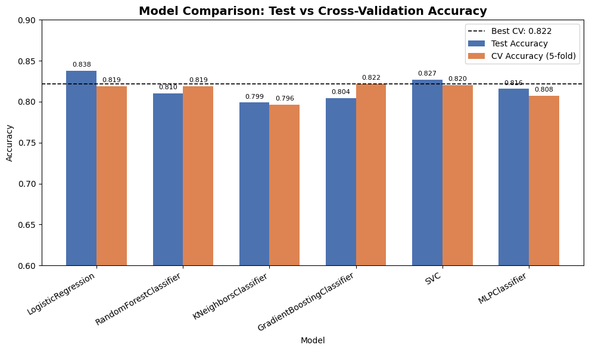
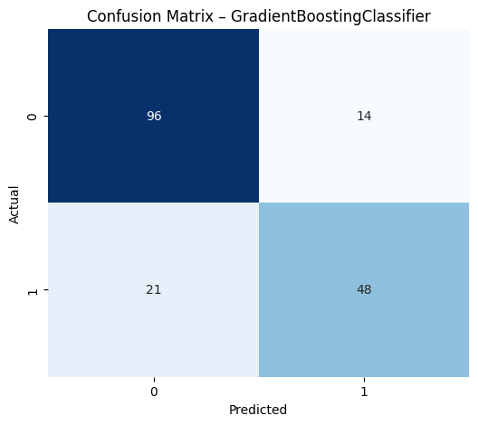

# 🚢 Titanic Survival Prediction

A complete end-to-end machine learning pipeline that benchmarks **six classification algorithms** on the Kaggle Titanic dataset. The project covers feature engineering, preprocessing, hyperparameter tuning with cross-validation, model comparison, and final model selection.

---

## 📂 Dataset

| Property | Value |
|---|---|
| Source | [Kaggle – Titanic: Machine Learning from Disaster](https://www.kaggle.com/c/titanic/data) |
| Training samples | 891 |
| Features | 12 raw (Age, Sex, Pclass, Fare, SibSp, Parch, etc.) |
| Target | `Survived` (0 = No, 1 = Yes) |

> Download `train.csv` from Kaggle and place it in the project root before running the notebook.

---

## ⚙️ Feature Engineering

Two features were engineered that provided the most significant performance gains across all models:

- **`Title`** — extracted from passenger names (Mr, Mrs, Miss, Master, Rare). Captures social class, age group, and marital status implicitly.
- **`FamilySize`** — computed as `SibSp + Parch + 1`. Both very large families and solo travellers showed lower survival rates.

**Columns dropped:** `PassengerId`, `Name`, `Ticket`, `Cabin`, `Embarked`  
(`Embarked` was excluded after showing near-zero feature importance in preliminary analysis.)

---

## 🧹 Preprocessing Pipeline

A unified `sklearn` pipeline was applied consistently across all six models before training:

| Feature Type | Imputation | Scaling / Encoding |
|---|---|---|
| Numeric (`Age`, `Fare`, `SibSp`, `Parch`, `FamilySize`) | Median | StandardScaler (zero mean, unit variance) |
| Categorical (`Sex`, `Title`) | Mode | One-Hot Encoding (drop first to avoid dummy trap) |

Data split: **80% train / 20% test** with stratification on the target variable.

---

## 🤖 Models & Hyperparameter Tuning

Each model was tuned using `GridSearchCV` with **5-fold cross-validation** on the training set.

| Model | Best Hyperparameters |
|---|---|
| Logistic Regression | `C = 10` |
| Random Forest | `n_estimators = 150`, `max_depth = 3`, `min_samples_split = 2` |
| KNN | `n_neighbors = 9` |
| Gradient Boosting | `learning_rate = 0.1`, `max_depth = 3`, `n_estimators = 100` |
| SVM (RBF kernel) | `C = 1`, `gamma = 'scale'` |
| MLP Neural Network | `hidden_layer_sizes = (50,)`, `alpha = 0.0001`, `learning_rate_init = 0.001` |

---

## 📊 Results

Models ranked by 5-fold CV accuracy (the selection criterion used for the final model):

| Model | Test Accuracy | Precision | Recall | F1 Score | CV Accuracy (5-fold) |
|---|---|---|---|---|---|
| Gradient Boosting | 0.804 | 0.774 | 0.696 | 0.733 | **0.822 ± 0.020** |
| SVM (RBF) | 0.827 | 0.797 | 0.739 | 0.767 | 0.820 ± 0.014 |
| Logistic Regression | **0.838** | 0.813 | 0.754 | 0.782 | 0.819 ± 0.023 |
| Random Forest | 0.810 | 0.787 | 0.696 | 0.738 | 0.819 ± 0.019 |
| MLP Neural Network | 0.816 | 0.800 | 0.696 | 0.744 | 0.808 ± 0.024 |
| KNN | 0.799 | 0.780 | 0.667 | 0.719 | 0.796 ± 0.025 |

---

## 🏆 Best Model: Gradient Boosting

**Gradient Boosting** was selected as the final model based on the highest 5-fold CV accuracy (**82.2%**), which is the more reliable indicator of generalisation than a single test-set score. Logistic Regression edges it out on raw test accuracy (83.8% vs 80.4%), but with stratified sampling, the CV scores across the top four models (Gradient Boosting, SVM, Logistic Regression, Random Forest) sit within a 0.3-point band of each other — they are effectively tied, and Gradient Boosting's slight CV edge plus its lower variance (±0.020) made it the marginal pick.

### Confusion Matrix — Gradient Boosting

```
              Predicted: 0    Predicted: 1
Actual: 0         96              14
Actual: 1         21              48
```

- **True Negatives (correctly predicted not survived):** 96
- **True Positives (correctly predicted survived):** 48
- **False Positives:** 14
- **False Negatives:** 21

### Model Comparison — Test vs CV Accuracy


<!-- TODO: replace image2.png with your exported bar chart (test accuracy vs CV accuracy, best CV model outlined) -->

### Confusion Matrix — Best Model



---

## 🧠 Key Takeaways

1. **Gradient Boosting is the final choice based on 5-fold CV accuracy (82.2%)** — with stratified sampling preserving the true ~38/62 survival split across train and test sets, this is the most reliable generalisation estimate available here.
2. **Feature engineering was the biggest lever** — extracting `Title` alone produced the most consistent accuracy improvement across all six models.
3. **The top four models are effectively tied** — Gradient Boosting, SVM, Logistic Regression, and Random Forest all land within a 0.3-point CV accuracy band (81.9%–82.2%), signalling that no single algorithm is decisively superior on this dataset; the ranking is sensitive to small changes like stratification.
4. **KNN underperformed** — its best CV accuracy (79.6%) trails the rest, consistent with its known sensitivity to feature scale and the curse of dimensionality after one-hot encoding.
5. **CV accuracy, not a single test split, is the right selection criterion** — Logistic Regression's higher test accuracy (83.8%) looked best on one split, but its CV accuracy is no better than its competitors — a reminder that single-split numbers can mislead.

---

[](https://colab.research.google.com/github/SKKammar/Titanic-Survival-Prediction/blob/main/TitanicSurvivalPrediction.ipynb)
## 🚀 How to Reproduce

```bash
# 1. Clone the repository
git clone https://github.com/SKKammar/Titanic-Survival-Prediction.git
cd Titanic-Survival-Prediction

# 2. Install dependencies
pip install pandas numpy scikit-learn matplotlib seaborn jupyter

# 3. Download train.csv from Kaggle and place it in the project root
# https://www.kaggle.com/c/titanic/data

# 4. Launch the notebook
jupyter notebook TitanicSurvivalPrediction.ipynb
```

---

## 🛠️ Tech Stack


